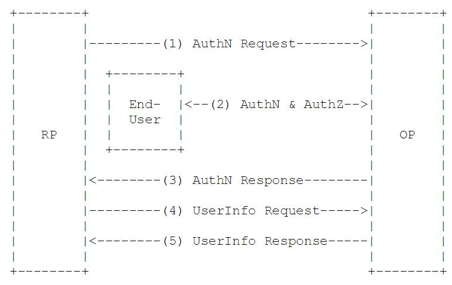

认证专题
===
| **版本** |     日期     | 修改描述 |
| :----: | :--------: | :--- |
|  v0.1  | 2017.12.20 | 新作成  |
---
# 摘要
微服务的架构具有分布式、分散式独立开发部署的特性，这种开放特性带来的是服务安全的下降；业界通过认证和授权流程确保系统面对攻击的安全性。分析常用的访问安全协议，提供云端安全访问方案

# 背景
## 微服务化
SDP上将应用分解为小的、互相连接的微服务，每个服务（包括UC）都有对应的域名，通过SDP应用工厂快速打包生成应用。
## 统一认证
提供统一的安全认证访问机制，提升整体SDP下端到端、端间访问安全，后续逐渐推进云端身份认证、数据访问安全机制，按照标准协议形成服务，并对外进行业务的开展。
# 认证协议
## OAUTH2
### 定义
OAuth 2.0是用于授权的行业标准协议。OAuth 2.0取代了2006年创建的OAuth协议所做的工作。OAuth 2.0侧重于客户端开发人员的简单性，同时为web应用程序，桌面应用程序等应用提供授权流
### 角色
+ 第三方应用：客户端
  客户端，即尝试去获得用户账号信息的应用，用户需要先对此操作授权。
+ API: 资源服务器
  即资源服务器，提供用来获得用户信息的API。
+ 授权服务器
  授权服务器用来提供接口，让用户同意或者拒接访问请求。在某些情况下，授权服务器和API资源服务器会是同一个，但是在大多数情况下，二者是独立的。
+ 用户：资源的拥有者
  资源的拥有者，当前的请求正在尝试获得他们账户的部分信息。
### 基本流程


（A）用户打开客户端以后，客户端要求用户给予授权。
（B）用户同意给予客户端授权。
（C）客户端使用上一步获得的授权，向认证服务器申请令牌。
（D）认证服务器对客户端进行认证以后，确认无误，同意发放令牌。
（E）客户端使用令牌，向资源服务器申请获取资源。
（F）资源服务器确认令牌无误，同意向客户端开放资源
### 授权模式
+ 授权码模式(authorization code)
  - 最完整、严密的授权模式适用于Web应用、浏览器应用或是移动APP;
  - 授权码，10分钟，与客户端id和重定向URI是一一对应的关系
+ 简化模式(implicit)
  - SDPUC认证模式
  - 减少授权码步骤
  - 客户端不需要验证
+ 密码模式（Resource owner password）
  - 其他授权模式无法执行情况下
  - 用户用用户名密码向认证服务直接换取accesstoken；
+ 客户端模式（Client Credentials Grant）
  - 适用于应用级访问；

### Different from Oauth 1.0

- 1.0适用范围，web；2.0移动端体验更佳
- 1.0通过加密算法保障授权的有效性，基于https
- 2.0性能，减少流程


## OpenID

### 简介
用户要使用OpenID就必须先在OpenID身份服务器（Identity Provider， IDP）获得OpenID 账号（比如Google账户）。用户可以使用OpenID账户来登录任何一个接受OpenID认证的服务应用（the relying party，RP，依赖方）。OpenID协议标准就是提供一个框架用来IDP和RP之间通信。

最初，openid1/2经查与OAuth协议一起提及，所以经常被搞混

openid是authentication，oauth是authorization

### OIDC

OpenID Connect，基于OAuth协议

OpenID-Connect协议中也包含了client_id、client_secret还有redirect_uri等字段标识。这些信息被保存在“身份认证服务器”，以确保特定的客户端收到的信息只来自于合法的应用平台。这样做是目的是为了防止client_id泄露而造成的恶意网站发起的OIDC流程

OIDC的核心在于在OAuth2的授权流程中，一并提供用户的身份认证信息（ID-Token）给到第三方客户端，ID-Token使用JWT格式来包装，得益于JWT（JSON Web Token）的自包含性，紧凑性以及防篡改机制，使得ID-Token可以安全的传递给第三方客户端程序并且容易被验证。应有服务器，在验证ID-Token正确只有，使用Access-Token向UserInfo的接口换取用户的更多的信息。

ID Token必须使用JWT(JSON Web Token)进行签名和JWE(JSON Web Encryption)加密，从而提供认证的完整性、不可否认性以及可选的保密性


```
  {
   "access_token": "SlAV32hkKG",
   "token_type": "Bearer",
   "refresh_token": "8xLOxBtZp8",
   "expires_in": 3600,
   "id_token": "eyJhbGciOiJSUzI1NiIsImtpZCI6IjFlOWdkazcifQ.ewogImlzc
     yI6ICJodHRwOi8vc2VydmVyLmV4YW1wbGUuY29tIiwKICJzdWIiOiAiMjQ4Mjg5
     NzYxMDAxIiwKICJhdWQiOiAiczZCaGRSa3F0MyIsCiAibm9uY2UiOiAibi0wUzZ
     fV3pBMk1qIiwKICJleHAiOiAxMzExMjgxOTcwLAogImlhdCI6IDEzMTEyODA5Nz
     AKfQ.ggW8hZ1EuVLuxNuuIJKX_V8a_OMXzR0EHR9R6jgdqrOOF4daGU96Sr_P6q
     Jp6IcmD3HP99Obi1PRs-cwh3LO-p146waJ8IhehcwL7F09JdijmBqkvPeB2T9CJ
     NqeGpe-gccMg4vfKjkM8FcGvnzZUN4_KSP0aAp1tOJ1zZwgjxqGByKHiOtX7Tpd
     QyHE5lcMiKPXfEIQILVq0pc_E2DzL7emopWoaoZTF_m0_N0YzFC6g6EJbOEoRoS
     K5hoDalrcvRYLSrQAZZKflyuVCyixEoV9GfNQC3_osjzw2PAithfubEEBLuVVk4
     XUVrWOLrLl0nx7RkKU8NXNHq-rvKMzqg"
  }

```

### 角色

EU：End User，用户。
RP：Relying Party ，用来代指OAuth2中的受信任的客户端，身份认证和授权信息的消费方；
OP：OpenID Provider，有能力提供EU身份认证的服务方（比如OAuth2中的授权服务），用来为RP提供EU的身份认证信息；
ID-Token：JWT格式的数据，包含EU身份认证的信息。
UserInfo Endpoint：用户信息接口（受OAuth2保护），当RP使用ID-Token访问时，返回授权用户的信息，此接口必须使用HTTPS。

### 基本流程



（1）RP发送一个认证请求给OP，其中附带client_id；
（2）OP对EU进行身份认证；
（3）OP返回响应，发送token给RP；
（4）RP使用ID-Token和Access-Token获取用户信息；
（5）RP接收UserInfo EndPoint返回EU的Claims。

### JWT

JSON Web Token（JWT）是一个非常轻巧的规范，用于保障用户和服务器之间传递安全可靠的信息

结构：头部、载荷（Payload）、签名

+ 头部，定义jwt基本信息

```
{
  "typ": "JWT",
  "alg": "HS256"
}
```

+ payload，定义具体的操作

```
{
    "iss": "aqapi.101.com", --JWT签发系统,StringOrURI
    "iat": 1441593502,--签发时间
    "exp": 1441594722,--过期时间
    "aud": "wb.101.com",--使用方，需校验
    "sub": "777",--在签发系统唯一标示的上下文
    "from_user": "B",--使用方参数
    "target_user": "A"--使用方参数
}
```

+ 签名

  将上面2个Base64后的编码通过.进行连接，根据客户的密钥(示例为:777对应的)通过HS256算法进行加密，再使用.进行拼接

+ 示例

  ```
  euHCo7IFAgd1oRpSP7nzL7BF5t7ItiJ9.eyJmcIFAgd1oRpSP7nzL7BF5t7ItqpKq3VzZXIiOiJBIn0.rSWamyAYw7BF5t7ItqzL7BF5t7ItqpKViM
  --使用
  http://wb.101.com/add/?jwt=eu...ViM
  ```


+ 适用场景

  用户认证、授权系统
  web单点登录

# 解决方案

## Spring Cloud Security
项目依赖
```
 <dependency>
        <groupId>org.springframework.cloud</groupId>
        <artifactId>spring-cloud-starter-security</artifactId>
</dependency>
<dependency>
         <groupId>org.springframework.cloud</groupId>
         <artifactId>spring-cloud-starter-oauth2</artifactId>
 </dependency>
```
## CAS
# 参考资料

JWT：

[https://tools.ietf.org/html/draft-ietf-oauth-json-web-token-32](https://tools.ietf.org/html/draft-ietf-oauth-json-web-token-32)

OAuth2

https://oauth.net/2/


