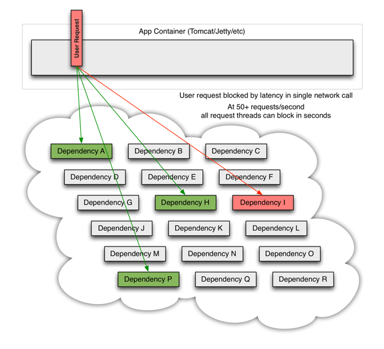
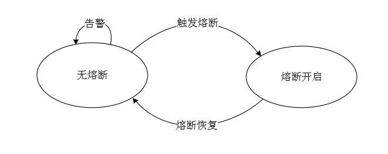
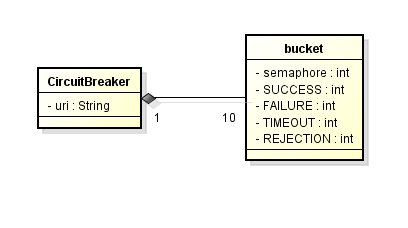
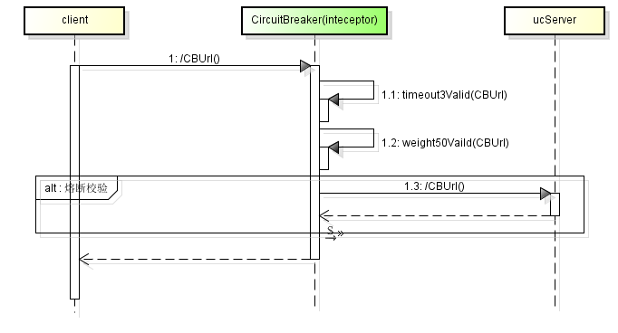

高可用服务专题
===
|**版本**|日期|修改描述|
|:-:|:-:|:-|
|v0.1|2017.3.29|新作成|
---
# 服务不可用的产生
- 正常服务，其中dependency可以是个微服务也可以是个dao

- 单某个依赖出现不可用（网络连接缓慢，资源繁忙，暂时不可用，服务脱机等），不影响其他的用户请求

- 当大多数服务器的线程池就出现阻塞(BLOCK),影响整个线上服务的可用性

# 如何提升服务高可用性
## 超时 timeout
对于uc来说，超时，主要体现在dao慢响应。
不过对于其他服务，会由于底层的慢响应，传导到自己的业务层，这时候需要超时时间对服务进行保护（超时时间选取，一般看provider正常响应时间是多少）
## 重试 retry
对于依赖其他服务的服务，超时机制可以起到保护作用，但有可能依赖的服务只是偶尔抖动，超时后直接放弃，不做后续处理，就会导致当前请求错误，也会带来业务方面的损失。
同时一般底层服务都会有负载均衡策略，基本上会切换一台机器来响应;如果有多地部署，可进行切换，避免某些实例临时负载较高的影响
## 幂等 idempotent
如果允许重试，那么服务必须做到幂等性，即无论调用多少次，其响应是一致的。
目前uc的无状态服务设计，基本上达到了服务的幂等性。
## 熔断 circuit break
根据服务的重要性，提供熔断机制，熔断主要应用于一般的服务。
如果核心服务down掉，基本上就没法提供服务，这个我们也没话说，但是如果是一般不重要的接口，却因为这个接口的慢响应，拖慢整个服务那么就得不偿失了。
如，UC的token颁发、验证属于工程院的基础安全访问机制，不能由于组织下模糊查找用户的问题，引起整个UC服务的不可用。
因此就出现了熔断的逻辑，也就是，如果检查出来频繁超时，就把请求直接短路掉(或返回固定的数据)。等服务恢复稳定之后，重新提供该接口的调用。
## 限流 current limiting
在服务能力有限的情况下， 应对流量激增，需根据服务的重要性，对某些服务进行降级限流处理
考虑服务的限流，防止重点服务被拖垮，当然也可以考虑资源隔离
## 缓存 cathe
数据库一般在服务体系的最底层，如果你的服务可以会自己完整缓存使用的数据，解除数据库依赖，那么即使数据库挂掉，你的服务就暂时是安全的。
## 小结
+ 超时时间的配置是为了保护服务
+ 重试为了应付偶尔的抖动
+ 幂等保障重试机制
+ 熔断机制保障重要服务
+ 限流保障流量激增的情况下，重要业务的请求
+ 缓存不仅提高性能，同时也提供高可用性保障

# 熔断器
为了保障帐号服务的高可用性，特别是基础认证接口的高可用性，通过增加熔断机制提高重点接口的sla
## 技术选型
+ spring boot actuator
actuator是spring boot提供的对应用系统的自省和监控的集成功能，可以对应用系统进行配置查看、相关功能统计等
+ Hystrix
Hystrix源于Netflix API团队在2011年启动的弹性工程工作,主要应对复杂分布式系统中的延时和故障容错，目前它在Netflix每天处理着数百亿的隔离线程以及数千亿的隔离信号调用。
主要功能：
   - 每个依赖都维护着一个线程池（信号），如果线程池被耗尽它将拒绝请求（而不是让请求排队）。
   - 依赖调用结果分:成功，失败（抛出异常），超时，线程拒绝，短路。 请求失败(异常，拒绝，超时，短路)时执行fallback(降级)逻辑
   - 熔断器默认错误率阈值为50%,超过将自动运行。
   - 提供近实时依赖的统计和监控
由于hystirx本身的限制，必须明确各服务之间调用的线程数，故对于很平滑的接口，是可以的，但目前对于公司来说，一天的量都会存在2个高峰，故此时线程数的设置不能很好的把控
+ Guava RateLimte
RateLimiter经常用于限制对一些物理资源或者逻辑资源的访问速率

## 业务领域建模
+ 熔断的设计主要参考了hystrix的思路
   - 熔断请求判断机制算法：每个熔断器默认维护10个bucket，每1秒一个bucket，每个bucket记录请求的成功、失败、超时、拒绝的状态，默认错误超过50%且10秒内超过20个请求进行中断拦截。
   - 熔断恢复：对于被熔断的请求，每隔5s允许部分请求通过，若请求都是健康的（RT < 500ms）则对请求健康恢复。
   - 熔断报警：对于熔断的请求打日志，异常请求超过某些设定则报警

+ 熔断状态
   - Closed：熔断器关闭状态，调用失败次数积累，到了阈值（或一定比例）则启动熔断机制；
   - Open：熔断器打开状态，此时对下游的调用都内部直接返回错误，不走网络，但设计了一个时钟选项，默认的时钟达到了一定时间（这个时间一般设置成平均故障处理时间，也就是MTTR），到了这个时间，进入半熔断状态；
+ 状态图

+ 数据模型

## 熔断流程

+ 通过注解定义接口开启熔断机制(则创建一个熔断器)
+ 一个熔断器对应10个bucket
+ 每分钟一个bucket,有对应的semaphore的  （11,21,31,41,51,1）
+ 超时设置为30s
+ 当有注解的url，有超时响应情况，则写对应分钟的bucket,有拒绝的情况也写对应分钟的bucket，写之前校验对应的semaphore，如果不是同一分钟的则先清0，后写

+ 总的错误超过10个则开启拒绝，小于10个则放过

+ fail=timeout+reject
## todolist

