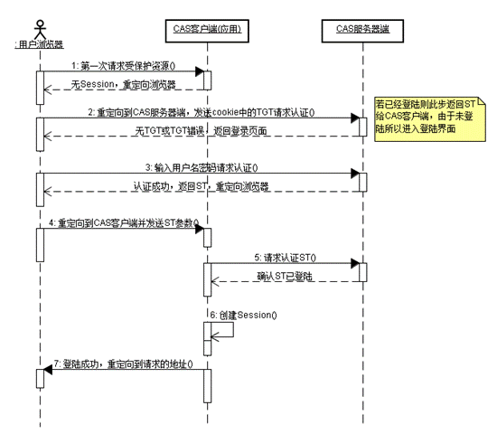

SSO专题
===
|**版本**|日期|修改描述|
|:-:|:-:|:-|
|v0.1|2017.6.21|新作成|
---
# 摘要
SDP-UC提供帐号、认证服务，是101帐号的认证中心，业务或组件通过认证服务提供的MAC机制，实现从客户端到服务端的安全访问。同时UC提供基础认证相关能力支持，其中SSO是比较重要的一个功能。通过分析目前SDP微服务化，参考SAML2.0协议，特别是业界经典的开源CAS实现，结合MAC机制，提出SDP的SSO方案。

# 背景
## 微服务化
SDP上将应用分解为小的、互相连接的微服务，每个服务（包括UC）都有对应的域名，通过SDP应用工厂快速打包生成应用。
## 域名规范
### 组件域名现状

### 组件域名规范
- 支持应用二级域名，规则：{app-short-name}.site.sdp.101.com/{service-short-name}?
- 私有化域名部署，规则：{app-domain-name}/{service-short-name}?
- 其中私有化部署，可以通过cname，把私有化域名重定向成第一个需求
### 独立应用ng集群

## SAML（Security Assertion Markup Language）
### 简介
SAML(Security Assertion Markup Language) 安全断言标记语言是由标识化组织 OASIS 提出的用于安全互操作的标准。SAML 是一个 XML 框架，由一组协议组成，用来传输安全声明。SAML 获得了广泛的行业认可，并被诸多主流厂商所支持。
### SAML协议核心

- profiles：规定一整套认证方案
- bindings：通讯协议绑定(http,soap)
- protocals：请求响应协议
- assertions：数据格式
参考文档：https://en.wikipedia.org/wiki/SAML_2.0
### SAML处理流程

### SAML的实现-CAS
其中CAS是最广泛应用的的开源单点登录产品，并支持了SAML。CAS （ Central Authentication Service ） 是 Yale 大学发起的一个企业级的、开源的项目，旨在为 Web 应用系统提供一种可靠的单点登录解决方法，在 2004 年 12 月正式成为 JA-SIG 的一个项目。

# web单点登录
## 前后端数据分离模式
后端提供访问接口，前端使用ajax拉取数据，使用vue绑定数据
- 多组件登录
  - 产品依赖web组件统一由应用工厂进行配置

## servlet模式
直接由后端服务提供,通过el，jstl，freemark等后端数据生成页面再响应到前端
- 基础流程

## 混合场景

## 独立管理后台
- 管理后台的jsessionid与adminsessionid

# 移动端单点登录 

iOS:uc://?username=${username}&token=${token}
Android: com.kd.uc://?username=${username}&token=${token}