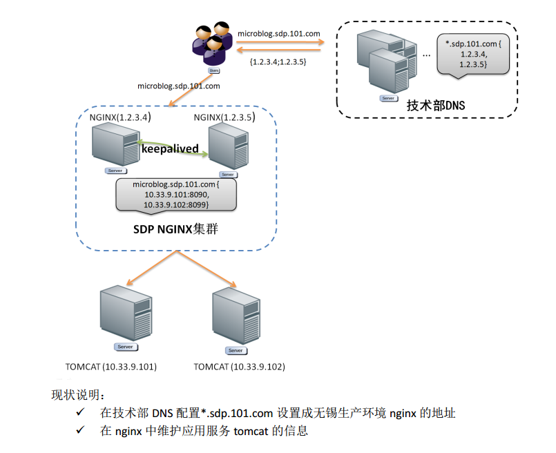
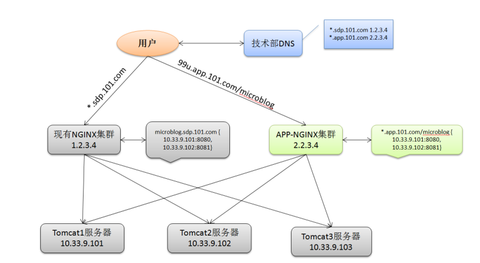
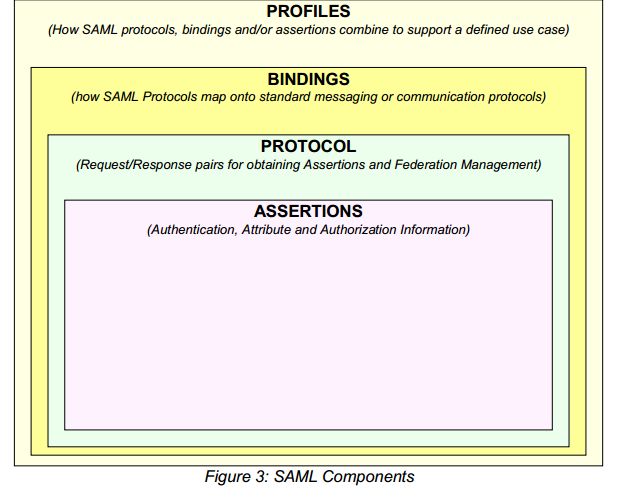
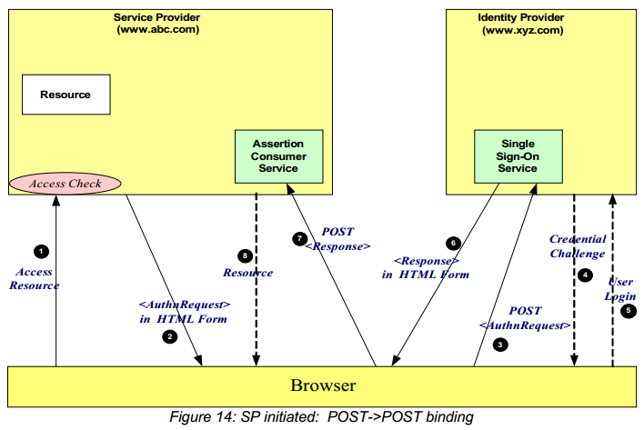
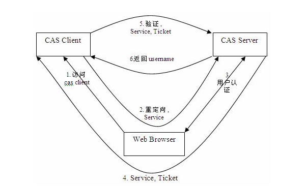
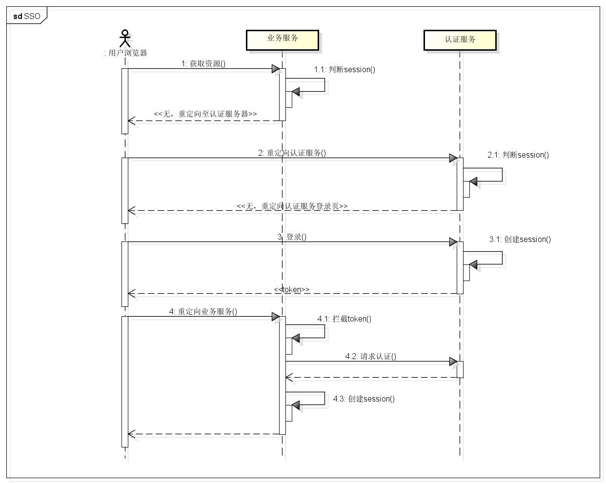

SSO专题
===
|**版本**|日期|修改描述|
|:-:|:-:|:-|
|v0.1|2017.6.21|新作成|
|v0.2|2018.5.9|方案演进|
---
# 摘要
SDP-UC提供帐号、认证服务，是101帐号的认证中心，业务或组件通过认证服务提供的MAC机制，实现从客户端到服务端的安全访问。其中SSO是比较重要的一个功能。
参考SAML2.0协议，结合开源CAS实现，依赖端到端认证MAC机制，提出SDP的SSO方案。

# 背景
## 微服务化
SDP上将应用分解为小的、互相连接的微服务，每个服务（包括UC）都有对应的域名，通过SDP应用工厂快速打包生成应用。
## 域名规范
### 组件域名现状

### 组件域名规范
- 支持应用二级域名，规则：{app-short-name}.site.sdp.101.com/{service-short-name}?
- 私有化域名部署，规则：{app-domain-name}/{service-short-name}?
- 其中私有化部署，可以通过cname，把私有化域名重定向成第一个需求
### 独立应用ng集群

## SAML（Security Assertion Markup Language）
### 简介
SAML(Security Assertion Markup Language) 安全断言标记语言是由标识化组织 OASIS 提出的用于安全互操作的标准。SAML 是一个 XML 框架，由一组协议组成，用来传输安全声明。SAML 获得了广泛的行业认可，并被诸多主流厂商所支持。
### SAML协议核心

- profiles：规定一整套认证方案
- bindings：通讯协议绑定(http,soap)
- protocals：请求响应协议
- assertions：数据格式
参考文档：https://en.wikipedia.org/wiki/SAML_2.0
### SAML处理流程

### SAML的实现-CAS
其中CAS是最广泛应用的的开源单点登录产品，并支持了SAML。CAS （ Central Authentication Service ） 是 Yale 大学发起的一个企业级的、开源的项目，旨在为 Web 应用系统提供一种可靠的单点登录解决方法，在 2004 年 12 月正式成为 JA-SIG 的一个项目。

# web单点登录
## 单体应用
- 基础流程
同CAS访问流程，用户访问业务服务时，业务服务器校验session，无效情况下，通过重定向到认证服务器，进行认证，如认证服务session有效，直接颁发token至用户浏览器，业务服务器校验此token，通过则存储Session，并将sessionID返回至浏览器，存储在浏览器的cookie中
- 流程图

- SAML实现
  - 采用XML标准的SAML安全断言语言，进行系统间数据交换认证
  - 有效登录凭据或有效会话存储于Cookie（如：cas的tgt，tgc，st亦存储于Cookie），以验证用户身份
## 微服务模式
在SSO上与单体应用典型差异
1、前后端分离
2、微服务对应的web组件不提供session机制
3、一个web组件可能应用于不同的产品
### 典型微服务SSO方案
- session共享
  - 各微服务均基于 Session 的认证。默认Session存储在应用服务器中，并且将SessionID返回到客户端，存储在浏览器的Cookie中。
  - 通过 Session 复制方案来解决（可打开web中间件Session复制能力）。
  - 独立Session存储，如 Memchached、Redis 等
- token【目前方案】
  - 认证服务颁发token
  - token会附加到每个请求上，为微服务提供用户身份验证
  - 登出依赖token过期机制
- token+网关
   - 通过网关，拦截认证信息，统一进行session控制
   - 请求时，网关存储sessionid与token之间关系
## 混合场景

# 移动端单点登录 

iOS:uccomponent://?username=${username}&token=${token}

Android: com.nd.uccomponent://?username=${username}&token=${token}