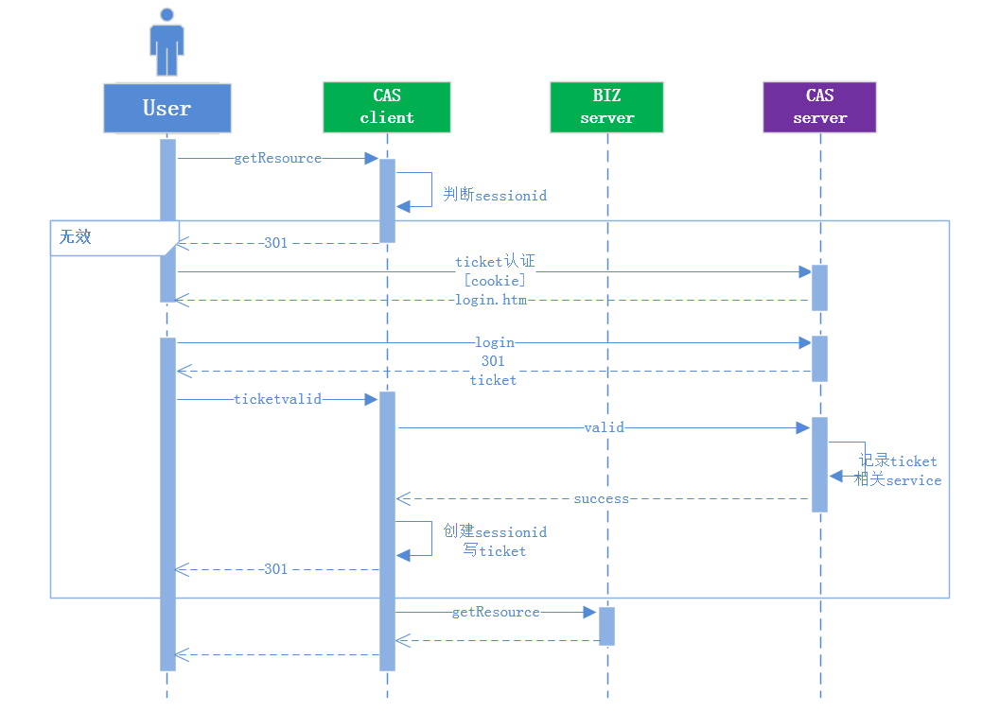

SSO专题
===
|**版本**|日期|修改描述|
|:-:|:-:|:-|
|v0.1|2016.3.22|新作成|
---
# web单点登录
## 基于组织登录
- 前后端数据分离模式

# 移动端单点登录

\\   反斜线
\`   反引号
\*   星号
\_   底线
\{}  花括号
\[]  方括号
\()  括弧
\#   井字号
\+   加号
\-   减号
\.   英文句点
\!   惊叹号

1.前后端分离流程
2.单页应用

# 附：CAS
